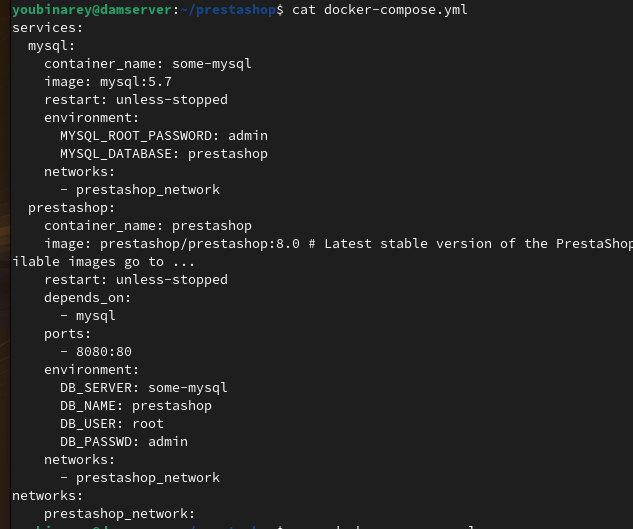
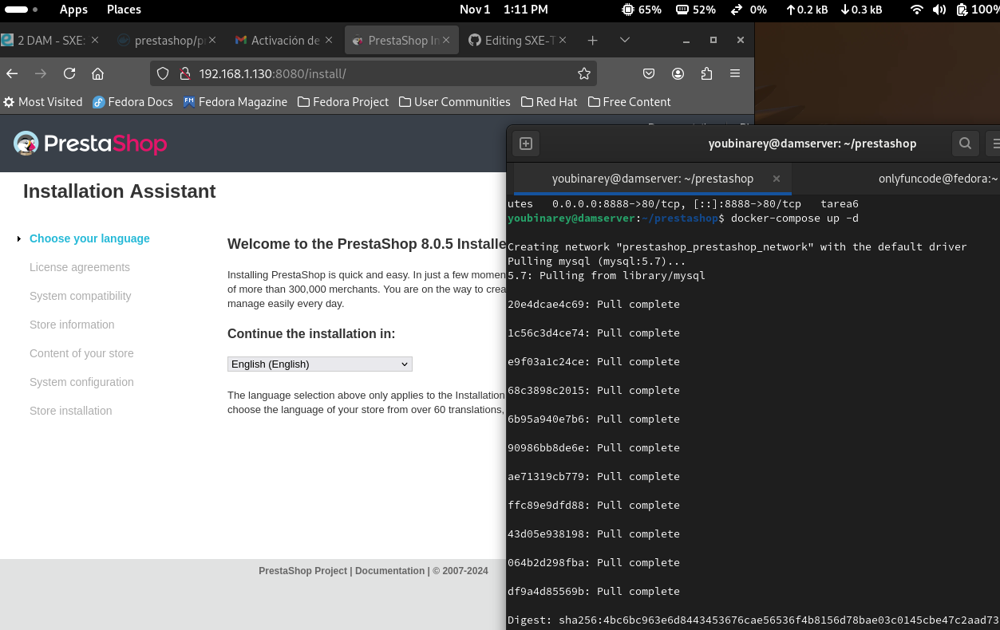

# Tarea6
## Utiliza docker para poner en marcha Prestashop:8.0

### 1. Instalar docker-compose
  ````sudo apt install docker-compose -y````

### 2. Crear directorio y fichero de configuración
  ````nano docker-compose.yml````

### 3. Configurar el fichero


### 4. Lanzar el contenedor
````docker-compose up -d````
#### d- para ejecutarse en segundo plano

### 5. Comprobar desde el navegador que prestashop está corriendo

